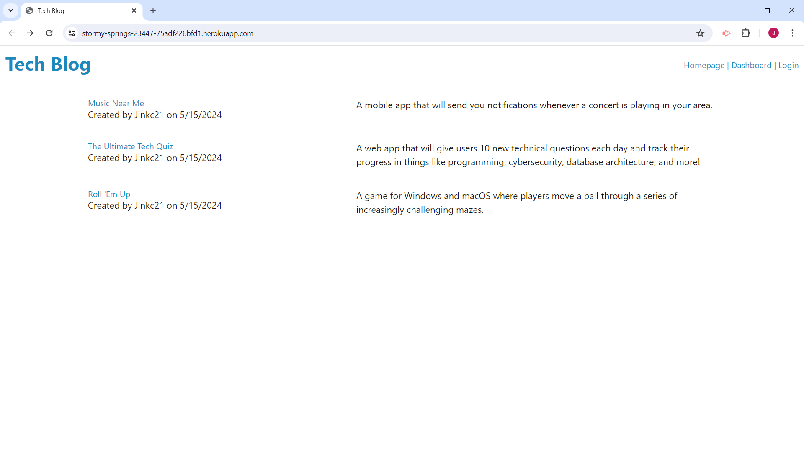
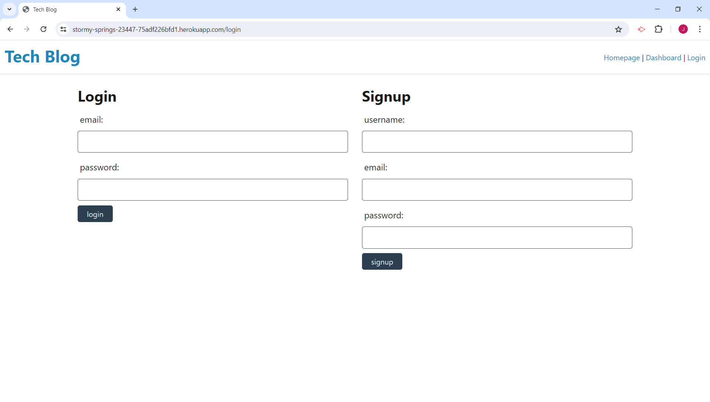
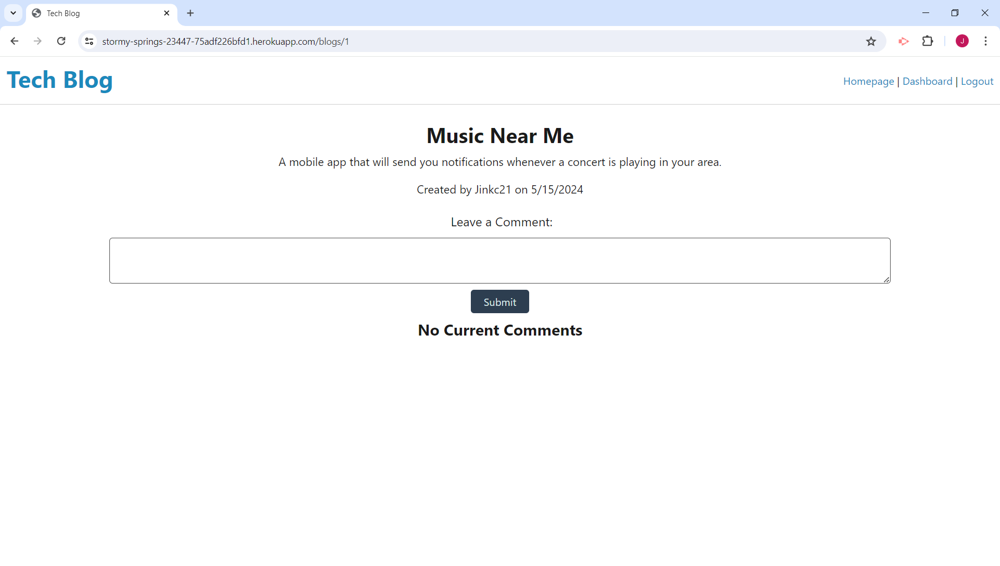
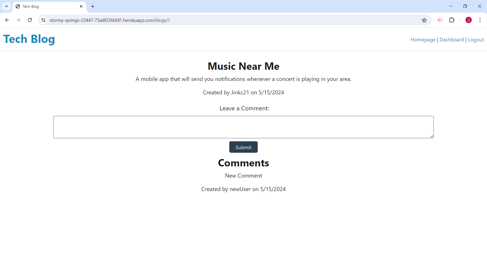
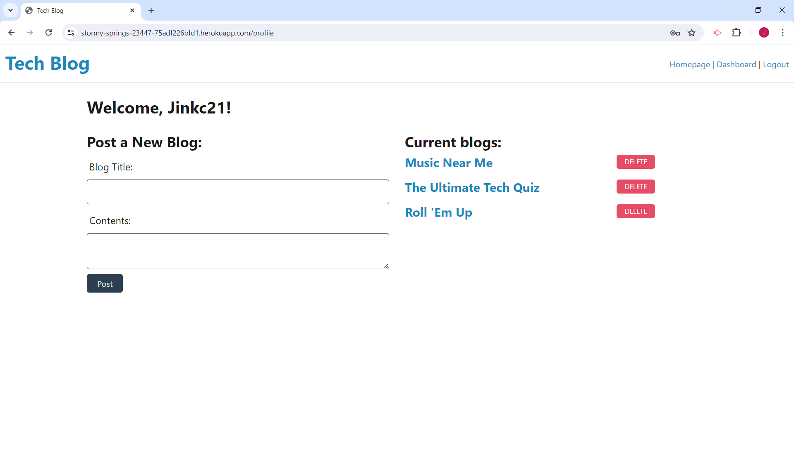

# (MVC): Tech Blog

## Description

Writing about tech can be just as important as making it. Developers spend plenty of time creating new applications and debugging existing codebases, but most developers also spend at least some of their time reading and writing about technical concepts, recent advancements, and new technologies.

This CMS-style blog site is similar to a Wordpress site. Developers can publish their blog posts and comment on other developers’ posts as well.

## Table of Contents (Optional)

If your README is long, add a table of contents to make it easy for users to find what they need.

- [Installation](#installation)
- [Usage](#usage)
- [Credits](#credits)
- [License](#license)

## Installation

Just visit:
https://stormy-springs-23447-75adf226bfd1.herokuapp.com/

## Usage

When visiting the site for the first time, users are presented with the homepage, which includes existing blog posts if any have been posted; navigation links for the homepage and the dashboard; and the option to log in.
The homepage shows existing blog posts that include the post title and the date created.

When users click on dashboard or login in the navigation they are prompted to either sign up or sign in.
The login page allows existing users to login using their email and password. New users can sign up with a username, email, and password.

When signed in to the site users see navigation links for the homepage, the dashboard, and the option to log out.
Clicking on an existing blog post will display the post title, contents, post creator’s username, and date created for that post.

Users also have the option to leave a comment if they are logged in.

Clicking on the dashboard option in the navigation will take users to the dashboard and presented with any blog posts they have already created and the option to add a new blog post.
Users also have the option to delete their current blogs.

The logout option in the navigation will log users out of their session.
The session will also end after a specific amount of time and log out the user.

## Credits
Documentation for express handlebars helped design the views:
https://www.npmjs.com/package/express-handlebars

Express session official readme helped create the sessions:
https://github.com/expressjs/session#cookie

Sequelize documentation helped with associations:
https://sequelize.org/master/manual/assocs.html

This resource helped with deleting blogs:
https://www.w3docs.com/learn-javascript/bubbling-and-capturing.html

## License

MIT License

Copyright (c) 2024 jinkc21

Permission is hereby granted, free of charge, to any person obtaining a copy
of this software and associated documentation files (the "Software"), to deal
in the Software without restriction, including without limitation the rights
to use, copy, modify, merge, publish, distribute, sublicense, and/or sell
copies of the Software, and to permit persons to whom the Software is
furnished to do so, subject to the following conditions:

The above copyright notice and this permission notice shall be included in all
copies or substantial portions of the Software.

THE SOFTWARE IS PROVIDED "AS IS", WITHOUT WARRANTY OF ANY KIND, EXPRESS OR
IMPLIED, INCLUDING BUT NOT LIMITED TO THE WARRANTIES OF MERCHANTABILITY,
FITNESS FOR A PARTICULAR PURPOSE AND NONINFRINGEMENT. IN NO EVENT SHALL THE
AUTHORS OR COPYRIGHT HOLDERS BE LIABLE FOR ANY CLAIM, DAMAGES OR OTHER
LIABILITY, WHETHER IN AN ACTION OF CONTRACT, TORT OR OTHERWISE, ARISING FROM,
OUT OF OR IN CONNECTION WITH THE SOFTWARE OR THE USE OR OTHER DEALINGS IN THE
SOFTWARE.

---
